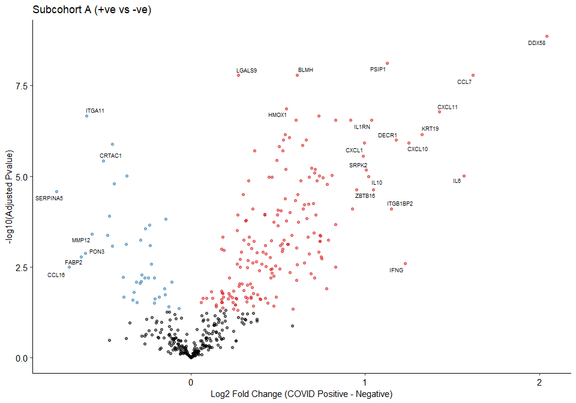
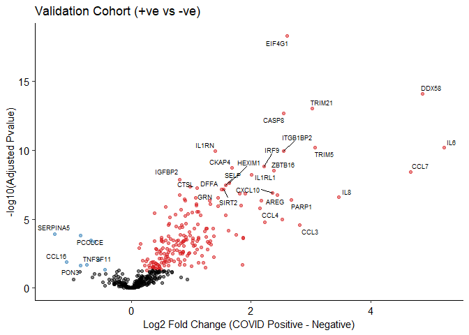
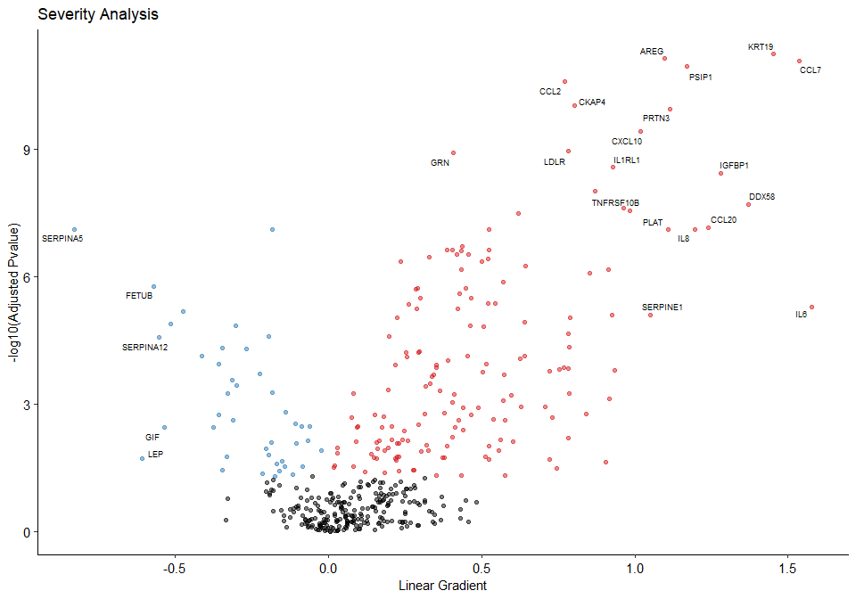
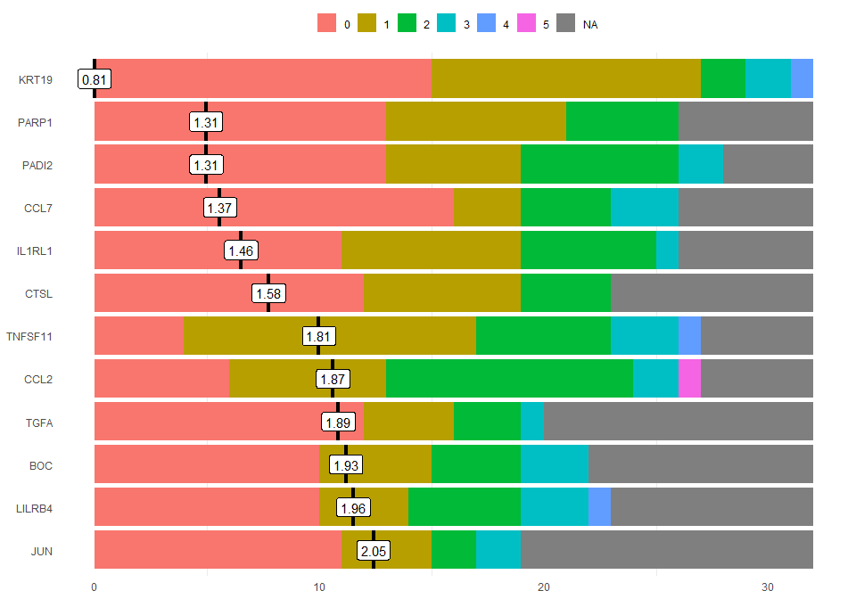

Example Analyses
================
Jack Gisby
2020-11-04

  - [Modified OlinkAnalyze Package](#modified-olinkanalyze-package)
  - [The Dataset](#the-dataset)
  - [COVID +ve vs -ve Differential
    Abundance](#covid-ve-vs--ve-differential-abundance)
  - [Severity Differential Abundance](#severity-differential-abundance)
  - [Joint Models](#joint-models)
  - [Random Forests](#random-forests)
  - [Longitudinal Models](#longitudinal-models)

# Modified OlinkAnalyze Package

To run the analyses we have generated a modified version of the
OlinkAnalyze package. This includes functions for applying linear mixed
models and joint models to all proteins in the dataset.

The package, also contained in this repository, must be installed in
order to run this script. This also contains the code used to generate
the models if of interest.

``` r
devtools::install_github(repo ='jackgisby/longitudinal_olink_proteomics/OlinkAnalyze_Modified')
library(OlinkAnalyzeModified)
```

# The Dataset

A public version of the dataset is provided for replication of results
and further investigation. We have split the primary (plasma) and
validation (serum) into separate CSVs. The NPX (protein expression)
level data contains a row for each data point whilst the sample level
data contains phenotypic data and clinical measurements; the
`serum_samples` dataframe has less columns than the `plasma_samples`
dataframe as it does not contain contemporaneous sample data.

Note that for the models we generated exact age was used, however we
have only provided binned age in the public dataset. Therefore, exact
results may differ slightly depending on the analysis.

``` r
# load protein expression data
plasma_long <- read.csv("../data/plasma_npx_level.csv")
serum_long <- read.csv("../data/serum_npx_level.csv")

# load related pheno data
plasma_samples <- read.csv("../data/plasma_sample_level.csv")
serum_samples <- read.csv("../data/serum_sample_level.csv")

# combine into single dataframe
plasma_full <- dplyr::left_join(plasma_long, plasma_samples)
```

    ## Joining, by = c("SampleID", "Individual_ID")

``` r
serum_full <- dplyr::left_join(serum_long, serum_samples)
```

    ## Joining, by = c("SampleID", "Individual_ID")

# COVID +ve vs -ve Differential Abundance

The following code chunk generates linear mixed models that predict NPX
levels for each protein from `Case_Control` status and covariates. The
`Individual_ID` is used as a random term to account for repeated
measurements. Volcano plots are generated and the proteins with the
highest logp values and fold changes are labelled.

``` r
plasma_case_control <- simple_mixed_de(
    plasma_full, 
    labels=0.1, 
    logp_label=6.8,             
    variable="Case_Control",       
    plot_xlab = "Log2 Fold Change (COVID Positive - Negative)", 
    plot_title="Primary Cohort (+ve vs -ve)",
    random="Individual_ID",
    covariates = c("Sex", "Age", "Ethnicity")
)
```

    ## Variables and covariates converted from character to factors: Case_Control, Sex, Age, Ethnicity, Individual_ID

    ## Linear mixed effects model fit to each assay: NPX~Case_Control+Sex+Age+Ethnicity+(1|Individual_ID)

    ## Variables and covariates converted from character to factors: Case_Control, Sex, Age, Ethnicity, Individual_ID

    ## Linear mixed effects model fit to each assay: NPX~Case_Control+Sex+Age+Ethnicity+(1|Individual_ID)

    ## Joining, by = "GeneID"

<!-- -->

``` r
head(plasma_case_control)
```

    ## # A tibble: 6 x 15
    ##   Assay GeneID UniProt Panel term   sumsq meansq NumDF DenDF statistic  p.value
    ##   <chr> <chr>  <chr>   <chr> <chr>  <dbl>  <dbl> <int> <dbl>     <dbl>    <dbl>
    ## 1 DDX58 DDX58  O95786  IR    Case~ 95.7   95.7       1  173.      56.3 3.16e-12
    ## 2 PSIP1 PSIP1  O75475  IR    Case~ 26.6   26.6       1  166.      50.4 3.43e-11
    ## 3 Gal-9 LGALS9 O00182  CVD2  Case~  0.759  0.759     1  121.      49.3 1.37e-10
    ## 4 MCP-3 CCL7   P80098  In    Case~ 44.8   44.8       1  157.      47.0 1.56e-10
    ## 5 BLM ~ BLMH   Q13867  CVD3  Case~  6.74   6.74      1  149.      46.8 1.89e-10
    ## 6 HO-1  HMOX1  P09601  CVD2  Case~  3.84   3.84      1  134.      41.6 1.88e- 9
    ## # ... with 4 more variables: Adjusted_pval <dbl>, Threshold <chr>, fc <dbl>,
    ## #   logp <dbl>

``` r
serum_case_control <- simple_mixed_de(
    serum_full, 
    labels=0.1, 
    logp_label=7,
    variable="Case_Control", 
    plot_xlab = "Log2 Fold Change (COVID Positive - Negative)", 
    plot_title="Validation Cohort (+ve vs -ve)",
    random="Individual_ID",
    covariates = c("Sex", "Age", "Ethnicity"),
)
```

    ## Variables and covariates converted from character to factors: Case_Control, Sex, Age, Ethnicity, Individual_ID

    ## Linear mixed effects model fit to each assay: NPX~Case_Control+Sex+Age+Ethnicity+(1|Individual_ID)

    ## Variables and covariates converted from character to factors: Case_Control, Sex, Age, Ethnicity, Individual_ID

    ## Linear mixed effects model fit to each assay: NPX~Case_Control+Sex+Age+Ethnicity+(1|Individual_ID)

    ## Joining, by = "GeneID"

<!-- -->

``` r
head(serum_case_control)
```

    ## # A tibble: 6 x 15
    ##   Assay GeneID UniProt Panel term  sumsq meansq NumDF DenDF statistic  p.value
    ##   <chr> <chr>  <chr>   <chr> <chr> <dbl>  <dbl> <int> <dbl>     <dbl>    <dbl>
    ## 1 EIF4~ EIF4G1 Q04637  IR    Case~  10.5   10.5     1  57.8     226.  1.21e-21
    ## 2 DDX58 DDX58  O95786  IR    Case~ 204.   204.      1  63.0     133.  3.56e-17
    ## 3 TRIM~ TRIM21 P19474  IR    Case~  34.2   34.2     1  58.1     122.  6.60e-16
    ## 4 CASP~ CASP8  Q14790  In    Case~  33.5   33.5     1  58.7     115.  1.92e-15
    ## 5 IL6   IL6    P05231  In    Case~  99.4   99.4     1  59.5      82.8 7.19e-13
    ## 6 TRIM5 TRIM5  Q9C035  IR    Case~  81.2   81.2     1  63.0      79.8 8.47e-13
    ## # ... with 4 more variables: Adjusted_pval <dbl>, Threshold <chr>, fc <dbl>,
    ## #   logp <dbl>

# Severity Differential Abundance

The following code chunk generates linear mixed models that predict NPX
levels for each protein using WHO severity at time of sampling encoded
as an ordinal variable. By default, polynomial contrasts (`?contr.poly`)
are generated for ordered factors. As with the `Case_Control` analysis,
covariates are entered into the model and `Individual_ID` is used as a
random term.

``` r
plasma_full$WHO_Severity_Contemporaneous <- ordered(plasma_full$WHO_Severity_Contemporaneous, c("NEGATIVE", "mild", "moderate", "severe", "critical"))

plasma_severity <- simple_mixed_de(
    plasma_full[plasma_full$Case_Control == "POSITIVE",], 
    labels=0.1, 
    logp_label = 8.5,
    variable="WHO_Severity_Contemporaneous",
    plot_xlab = "Linear Gradient", 
    plot_title="Severity Analysis",
    random="Individual_ID",
    covariates = c("Sex", "Age", "Ethnicity")
)
```

    ## Variables and covariates converted from character to factors: Sex, Age, Ethnicity, Individual_ID

    ## Linear mixed effects model fit to each assay: NPX~WHO_Severity_Contemporaneous+Sex+Age+Ethnicity+(1|Individual_ID)

    ## Variables and covariates converted from character to factors: Sex, Age, Ethnicity, Individual_ID

    ## Linear mixed effects model fit to each assay: NPX~WHO_Severity_Contemporaneous+Sex+Age+Ethnicity+(1|Individual_ID)

    ## Joining, by = "GeneID"

<!-- -->

# Joint Models

In our analysis, we generated joint models for each protein that combine
linear mixed models and Cox regression to predict risk of death using a
continuous covariate (NPX). The joint models are estimated using Markov
chain Monte Carlo (MCMC) and so take some time to run; therefore, in
this example we only generate a model for a single protein (AZU1).

``` r
summary(joint_model(plasma_full[plasma_full$Case_Control == "POSITIVE",], "AZU1"))
```

    ## 
    ##  MCMC iterations:
    ## 
    ##   |                                                          |                                                  |   0%  |                                                          |                                                  |   1%  |                                                          |+                                                 |   1%  |                                                          |+                                                 |   2%  |                                                          |+                                                 |   3%  |                                                          |++                                                |   3%  |                                                          |++                                                |   4%  |                                                          |++                                                |   5%  |                                                          |+++                                               |   5%  |                                                          |+++                                               |   6%  |                                                          |+++                                               |   7%  |                                                          |++++                                              |   7%  |                                                          |++++                                              |   8%  |                                                          |++++                                              |   9%  |                                                          |+++++                                             |   9%  |                                                          |+++++                                             |  10%  |                                                          |+++++                                             |  11%  |                                                          |++++++                                            |  11%  |                                                          |++++++                                            |  12%  |                                                          |++++++                                            |  13%  |                                                          |+++++++                                           |  13%  |                                                          |+++++++                                           |  14%  |                                                          |+++++++                                           |  15%  |                                                          |++++++++                                          |  15%  |                                                          |++++++++                                          |  16%  |                                                          |++++++++                                          |  17%  |                                                          |+++++++++                                         |  17%  |                                                          |+++++++++                                         |  18%  |                                                          |+++++++++                                         |  19%  |                                                          |++++++++++                                        |  19%  |                                                          |++++++++++                                        |  20%  |                                                          |++++++++++                                        |  21%  |                                                          |+++++++++++                                       |  21%  |                                                          |+++++++++++                                       |  22%  |                                                          |+++++++++++                                       |  23%  |                                                          |++++++++++++                                      |  23%  |                                                          |++++++++++++                                      |  24%  |                                                          |++++++++++++                                      |  25%  |                                                          |+++++++++++++                                     |  25%  |                                                          |+++++++++++++                                     |  26%  |                                                          |+++++++++++++                                     |  27%  |                                                          |++++++++++++++                                    |  27%  |                                                          |++++++++++++++                                    |  28%  |                                                          |++++++++++++++                                    |  29%  |                                                          |+++++++++++++++                                   |  29%  |                                                          |+++++++++++++++                                   |  30%  |                                                          |+++++++++++++++                                   |  31%  |                                                          |++++++++++++++++                                  |  31%  |                                                          |++++++++++++++++                                  |  32%  |                                                          |++++++++++++++++                                  |  33%  |                                                          |+++++++++++++++++                                 |  33%  |                                                          |+++++++++++++++++                                 |  34%  |                                                          |+++++++++++++++++                                 |  35%  |                                                          |++++++++++++++++++                                |  35%  |                                                          |++++++++++++++++++                                |  36%  |                                                          |++++++++++++++++++                                |  37%  |                                                          |+++++++++++++++++++                               |  37%  |                                                          |+++++++++++++++++++                               |  38%  |                                                          |+++++++++++++++++++                               |  39%  |                                                          |++++++++++++++++++++                              |  39%  |                                                          |++++++++++++++++++++                              |  40%  |                                                          |++++++++++++++++++++                              |  41%  |                                                          |+++++++++++++++++++++                             |  41%  |                                                          |+++++++++++++++++++++                             |  42%  |                                                          |+++++++++++++++++++++                             |  43%  |                                                          |++++++++++++++++++++++                            |  43%  |                                                          |++++++++++++++++++++++                            |  44%  |                                                          |++++++++++++++++++++++                            |  45%  |                                                          |+++++++++++++++++++++++                           |  45%  |                                                          |+++++++++++++++++++++++                           |  46%  |                                                          |+++++++++++++++++++++++                           |  47%  |                                                          |++++++++++++++++++++++++                          |  47%  |                                                          |++++++++++++++++++++++++                          |  48%  |                                                          |++++++++++++++++++++++++                          |  49%  |                                                          |+++++++++++++++++++++++++                         |  49%  |                                                          |+++++++++++++++++++++++++                         |  50%  |                                                          |+++++++++++++++++++++++++                         |  51%  |                                                          |++++++++++++++++++++++++++                        |  51%  |                                                          |++++++++++++++++++++++++++                        |  52%  |                                                          |++++++++++++++++++++++++++                        |  53%  |                                                          |+++++++++++++++++++++++++++                       |  53%  |                                                          |+++++++++++++++++++++++++++                       |  54%  |                                                          |+++++++++++++++++++++++++++                       |  55%  |                                                          |++++++++++++++++++++++++++++                      |  55%  |                                                          |++++++++++++++++++++++++++++                      |  56%  |                                                          |++++++++++++++++++++++++++++                      |  57%  |                                                          |+++++++++++++++++++++++++++++                     |  57%  |                                                          |+++++++++++++++++++++++++++++                     |  58%  |                                                          |+++++++++++++++++++++++++++++                     |  59%  |                                                          |++++++++++++++++++++++++++++++                    |  59%  |                                                          |++++++++++++++++++++++++++++++                    |  60%  |                                                          |++++++++++++++++++++++++++++++                    |  61%  |                                                          |+++++++++++++++++++++++++++++++                   |  61%  |                                                          |+++++++++++++++++++++++++++++++                   |  62%  |                                                          |+++++++++++++++++++++++++++++++                   |  63%  |                                                          |++++++++++++++++++++++++++++++++                  |  63%  |                                                          |++++++++++++++++++++++++++++++++                  |  64%  |                                                          |++++++++++++++++++++++++++++++++                  |  65%  |                                                          |+++++++++++++++++++++++++++++++++                 |  65%  |                                                          |+++++++++++++++++++++++++++++++++                 |  66%  |                                                          |+++++++++++++++++++++++++++++++++                 |  67%  |                                                          |++++++++++++++++++++++++++++++++++                |  67%  |                                                          |++++++++++++++++++++++++++++++++++                |  68%  |                                                          |++++++++++++++++++++++++++++++++++                |  69%  |                                                          |+++++++++++++++++++++++++++++++++++               |  69%  |                                                          |+++++++++++++++++++++++++++++++++++               |  70%  |                                                          |+++++++++++++++++++++++++++++++++++               |  71%  |                                                          |++++++++++++++++++++++++++++++++++++              |  71%  |                                                          |++++++++++++++++++++++++++++++++++++              |  72%  |                                                          |++++++++++++++++++++++++++++++++++++              |  73%  |                                                          |+++++++++++++++++++++++++++++++++++++             |  73%  |                                                          |+++++++++++++++++++++++++++++++++++++             |  74%  |                                                          |+++++++++++++++++++++++++++++++++++++             |  75%  |                                                          |++++++++++++++++++++++++++++++++++++++            |  75%  |                                                          |++++++++++++++++++++++++++++++++++++++            |  76%  |                                                          |++++++++++++++++++++++++++++++++++++++            |  77%  |                                                          |+++++++++++++++++++++++++++++++++++++++           |  77%  |                                                          |+++++++++++++++++++++++++++++++++++++++           |  78%  |                                                          |+++++++++++++++++++++++++++++++++++++++           |  79%  |                                                          |++++++++++++++++++++++++++++++++++++++++          |  79%  |                                                          |++++++++++++++++++++++++++++++++++++++++          |  80%  |                                                          |++++++++++++++++++++++++++++++++++++++++          |  81%  |                                                          |+++++++++++++++++++++++++++++++++++++++++         |  81%  |                                                          |+++++++++++++++++++++++++++++++++++++++++         |  82%  |                                                          |+++++++++++++++++++++++++++++++++++++++++         |  83%  |                                                          |++++++++++++++++++++++++++++++++++++++++++        |  83%  |                                                          |++++++++++++++++++++++++++++++++++++++++++        |  84%  |                                                          |++++++++++++++++++++++++++++++++++++++++++        |  85%  |                                                          |+++++++++++++++++++++++++++++++++++++++++++       |  85%  |                                                          |+++++++++++++++++++++++++++++++++++++++++++       |  86%  |                                                          |+++++++++++++++++++++++++++++++++++++++++++       |  87%  |                                                          |++++++++++++++++++++++++++++++++++++++++++++      |  87%  |                                                          |++++++++++++++++++++++++++++++++++++++++++++      |  88%  |                                                          |++++++++++++++++++++++++++++++++++++++++++++      |  89%  |                                                          |+++++++++++++++++++++++++++++++++++++++++++++     |  89%  |                                                          |+++++++++++++++++++++++++++++++++++++++++++++     |  90%  |                                                          |+++++++++++++++++++++++++++++++++++++++++++++     |  91%  |                                                          |++++++++++++++++++++++++++++++++++++++++++++++    |  91%  |                                                          |++++++++++++++++++++++++++++++++++++++++++++++    |  92%  |                                                          |++++++++++++++++++++++++++++++++++++++++++++++    |  93%  |                                                          |+++++++++++++++++++++++++++++++++++++++++++++++   |  93%  |                                                          |+++++++++++++++++++++++++++++++++++++++++++++++   |  94%  |                                                          |+++++++++++++++++++++++++++++++++++++++++++++++   |  95%  |                                                          |++++++++++++++++++++++++++++++++++++++++++++++++  |  95%  |                                                          |++++++++++++++++++++++++++++++++++++++++++++++++  |  96%  |                                                          |++++++++++++++++++++++++++++++++++++++++++++++++  |  97%  |                                                          |+++++++++++++++++++++++++++++++++++++++++++++++++ |  97%  |                                                          |+++++++++++++++++++++++++++++++++++++++++++++++++ |  98%  |                                                          |+++++++++++++++++++++++++++++++++++++++++++++++++ |  99%  |                                                          |++++++++++++++++++++++++++++++++++++++++++++++++++|  99%  |                                                          |++++++++++++++++++++++++++++++++++++++++++++++++++| 100%

    ## 
    ## Call:
    ## jointModelBayes(lmeObject = fitLME, survObject = fitSURV, timeVar = "Time_From_First_Symptoms", 
    ##     control = list(n.iter = 20000))
    ## 
    ## Data Descriptives:
    ## Longitudinal Process     Event Process
    ## Number of Observations: 223  Number of Events: 5 (10.6%)
    ## Number of subjects: 47
    ## 
    ## Joint Model Summary:
    ## Longitudinal Process: Linear mixed-effects model
    ## Event Process: Relative risk model with penalized-spline-approximated 
    ##      baseline risk function
    ## Parameterization: Time-dependent value 
    ## 
    ##  LPML     DIC      pD
    ##  -Inf 9911683 4955316
    ## 
    ## Variance Components:
    ##                                                                        StdDev
    ## (Intercept)                                                            1.1383
    ## bs(Time_From_First_Symptoms, degree = 2, Boundary.knots = c(0, 29))1   1.2369
    ## bs(Time_From_First_Symptoms, degree = 2, Boundary.knots = c(0, 29))2  13.7304
    ## Residual                                                               0.8352
    ##                                                                         Corr
    ## (Intercept)                                                           (Intr)
    ## bs(Time_From_First_Symptoms, degree = 2, Boundary.knots = c(0, 29))1 -0.2945
    ## bs(Time_From_First_Symptoms, degree = 2, Boundary.knots = c(0, 29))2 -0.0678
    ## Residual                                                                    
    ##                                                                              
    ## (Intercept)                                                          bd=2B=c2
    ## bs(Time_From_First_Symptoms, degree = 2, Boundary.knots = c(0, 29))1         
    ## bs(Time_From_First_Symptoms, degree = 2, Boundary.knots = c(0, 29))2  -0.0342
    ## Residual                                                                     
    ## 
    ## Coefficients:
    ## Longitudinal Process
    ##                                                                        Value
    ## (Intercept)                                                           0.2618
    ## bs(Time_From_First_Symptoms, degree = 2, Boundary.knots = c(0, 29))1 -0.0373
    ## bs(Time_From_First_Symptoms, degree = 2, Boundary.knots = c(0, 29))2  0.2460
    ##                                                                      Std.Err
    ## (Intercept)                                                           0.0077
    ## bs(Time_From_First_Symptoms, degree = 2, Boundary.knots = c(0, 29))1  0.0100
    ## bs(Time_From_First_Symptoms, degree = 2, Boundary.knots = c(0, 29))2  0.1080
    ##                                                                      Std.Dev
    ## (Intercept)                                                           0.1943
    ## bs(Time_From_First_Symptoms, degree = 2, Boundary.knots = c(0, 29))1  0.2388
    ## bs(Time_From_First_Symptoms, degree = 2, Boundary.knots = c(0, 29))2  2.1091
    ##                                                                         2.5%
    ## (Intercept)                                                          -0.1280
    ## bs(Time_From_First_Symptoms, degree = 2, Boundary.knots = c(0, 29))1 -0.4676
    ## bs(Time_From_First_Symptoms, degree = 2, Boundary.knots = c(0, 29))2 -3.8760
    ##                                                                       97.5%
    ## (Intercept)                                                          0.6367
    ## bs(Time_From_First_Symptoms, degree = 2, Boundary.knots = c(0, 29))1 0.5138
    ## bs(Time_From_First_Symptoms, degree = 2, Boundary.knots = c(0, 29))2 4.5490
    ##                                                                          P
    ## (Intercept)                                                          0.164
    ## bs(Time_From_First_Symptoms, degree = 2, Boundary.knots = c(0, 29))1 0.793
    ## bs(Time_From_First_Symptoms, degree = 2, Boundary.knots = c(0, 29))2 0.925
    ## 
    ## Event Process
    ##           Value Std.Err  Std.Dev    2.5%    97.5%      P
    ## Assoct   6.0922  0.4783   1.7287  3.6232   9.9025 <0.001
    ## tauBs  259.2098 28.6904 218.8793 25.6816 839.3453     NA
    ## 
    ## MCMC summary:
    ## iterations: 20000 
    ## adapt: 3000 
    ## burn-in: 3000 
    ## thinning: 10 
    ## time: 0.7 min

# Random Forests

We used the first sample for each individual to predict peak WHO
severity. A random forests model is generated using caret (using 10-fold
cross-validation repeated 10 times). Variable importance measures are
then calculated for each protein.

``` r
plasma_independent <- get_first_samples(plasma_full[plasma_full$Case_Control == "POSITIVE",])

plasma_independent$grouped_severity <- ifelse(
    plasma_independent$WHO_Severity_Peak %in% c("mild", "moderate"), 
    "mild_moderate", 
    "severe_critical"
)

set.seed(1)
plasma_rf <- run_rf(plasma_independent)
```

    ## Random Forest 
    ## 
    ##  54 samples
    ## 436 predictors
    ##   2 classes: 'mild_moderate', 'severe_critical' 
    ## 
    ## Pre-processing: nearest neighbor imputation (436), scaled (436), centered (436) 
    ## Resampling: Cross-Validated (10 fold, repeated 10 times) 
    ## Summary of sample sizes: 49, 49, 48, 48, 48, 49, ... 
    ## Resampling results:
    ## 
    ##   Accuracy   Kappa    
    ##   0.7126667  0.4272927
    ## 
    ## Tuning parameter 'mtry' was held constant at a value of 20
    ## 
    ## Call:
    ##  randomForest(x = x, y = y, mtry = param$mtry, localImp = TRUE,      proximity = TRUE, formula = grouped_severity ~ .) 
    ##                Type of random forest: classification
    ##                      Number of trees: 500
    ## No. of variables tried at each split: 20
    ## 
    ##         OOB estimate of  error rate: 29.63%
    ## Confusion matrix:
    ##                 mild_moderate severe_critical class.error
    ## mild_moderate              19               8   0.2962963
    ## severe_critical             8              19   0.2962963

<!-- -->

``` r
var_imp <- measure_importance(plasma_rf$finalModel)

head(var_imp)
```

    ##   variable mean_min_depth no_of_nodes accuracy_decrease gini_decrease
    ## 1     ACE2       3.721313           5      1.000000e-04    0.03604089
    ## 2     ACP5       3.873313           1      0.000000e+00    0.01484848
    ## 3      ADA       3.658813           5     -1.000000e-04    0.02412664
    ## 4 ADAMTS13       2.638187          15      2.526544e-04    0.18474913
    ## 5      ADM       3.750438           3      9.090909e-05    0.01436667
    ## 6     AGER       3.904563           1      0.000000e+00    0.00300000
    ##   no_of_trees times_a_root     p_value
    ## 1           5            0 0.805588033
    ## 2           1            0 0.998864537
    ## 3           5            0 0.805588033
    ## 4          15            5 0.004233153
    ## 5           3            0 0.965002070
    ## 6           1            0 0.998864537

# Longitudinal Models

Finally, we generate linear mixed models for each protein to predict NPX
from the interaction between peak WHO severity and time. Proteins with a
significant (FDR \< 0.05) interaction term were considered to have a
differential temporal expression depending on the severity of the
disease course peak.

``` r
formula_string <- "NPX ~ bs(Time_From_First_Symptoms, degree = 2) * grouped_severity + Age + Sex + Ethnicity + (bs(Time_From_First_Symptoms, degree = 2) | Individual_ID)"

plasma_full$grouped_severity <- ifelse(
    plasma_full$WHO_Severity_Peak %in% c("mild", "moderate"), 
    "mild_moderate", 
    "severe_critical"
)

lmm_prot_time <- plasma_full %>% 
    filter(Case_Control=="POSITIVE" & Time_From_First_Symptoms <= 21 & !is.na(Time_From_First_Symptoms)) %>%
    group_by(Assay, GeneID, UniProt, Panel) %>%
    group_modify(~tidy(anova(single_lmer(data=.x, formula_string = formula_string)))) %>%
    ungroup() %>%
    filter(term == "bs(Time_From_First_Symptoms, degree = 2):grouped_severity")

head(lmm_prot_time)
```

    ## # A tibble: 6 x 11
    ##   Assay  GeneID UniProt Panel term   sumsq  meansq NumDF DenDF statistic p.value
    ##   <chr>  <chr>  <chr>   <chr> <chr>  <dbl>   <dbl> <int> <dbl>     <dbl>   <dbl>
    ## 1 4E-BP1 EIF4E~ Q13541  In    bs(T~ 0.185  0.0926      2  57.5     3.57  0.0346 
    ## 2 ACE2   ACE2   Q9BYF1  CVD2  bs(T~ 0.584  0.292       2  18.7     5.96  0.00999
    ## 3 ADA    ADA    P00813  In    bs(T~ 0.146  0.0730      2  49.1     0.619 0.543  
    ## 4 ADAM-~ ADAMT~ Q76LX8  CVD2  bs(T~ 0.0281 0.0141      2  23.0     1.41  0.265  
    ## 5 ADM    ADM    P35318  CVD2  bs(T~ 0.0122 0.00608     2  44.3     0.523 0.596  
    ## 6 AGRP   AGRP   O00253  CVD2  bs(T~ 0.189  0.0944      2  25.1     0.988 0.386
