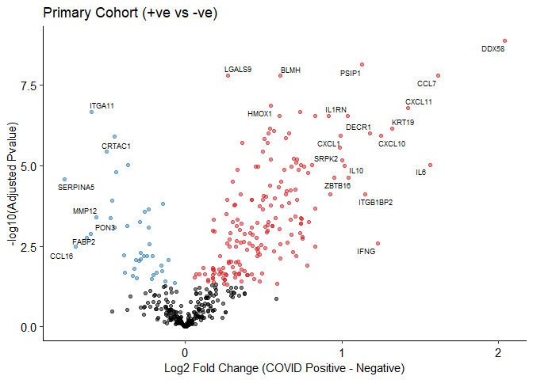
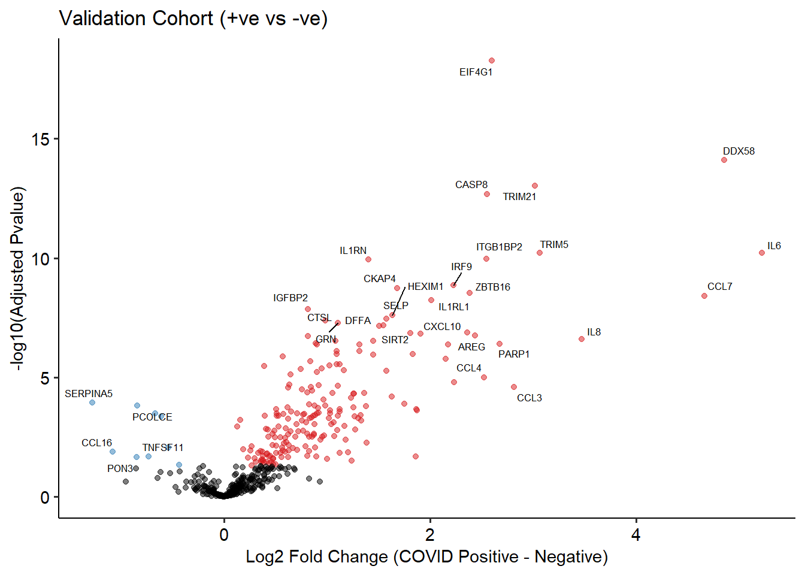
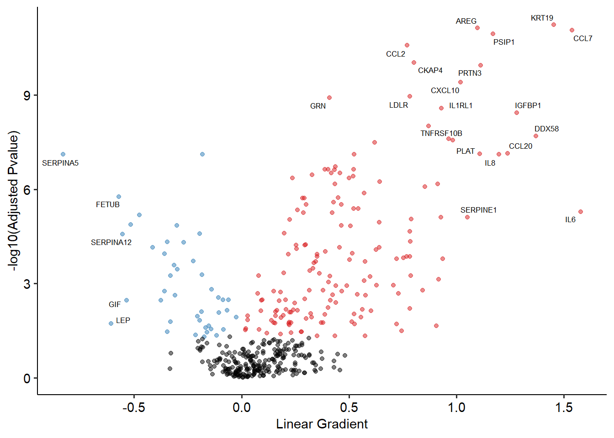
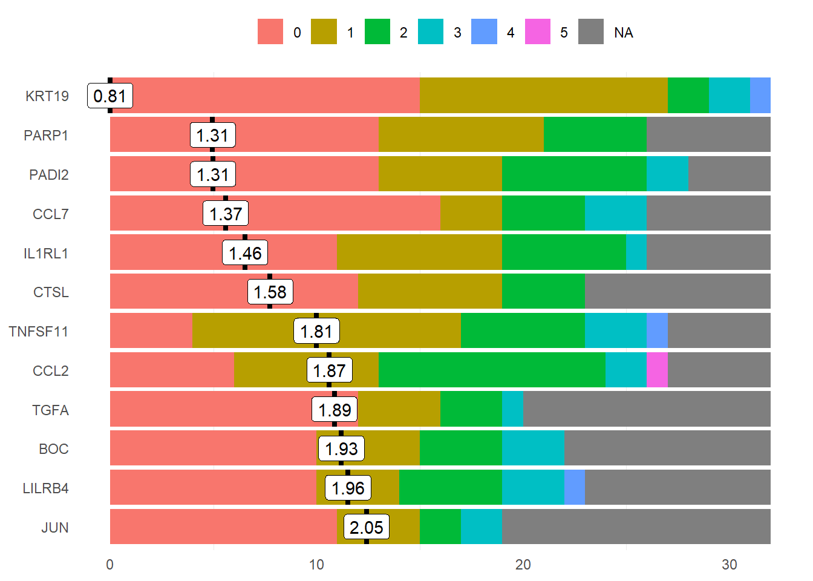

# Modified OlinkAnalyze Package

To run the analyses we have generated a modified version of the OlinkAnalyze package.
This includes functions for applying linear mixed models and joint models to all
proteins in the dataset. 

The package, also contained in this repository, must be installed in order to run this
script. This also contains the code used to generate the models if of interest.


```r
devtools::install_github(repo ='jackgisby/longitudinal_olink_proteomics/OlinkAnalyze_Modified')
library(OlinkAnalyzeModified)
```

# The Dataset

A public version of the dataset is provided for replication of results and further
investigation. We have split the primary (plasma) and validation (serum) into
seperate CSVs. The NPX (protein expression) level data contains a row for each data point whilst the
sample level data contains phenotypic data and clinical measurementst; the `serum_samples` 
dataframe has less columns than the `plasma_samples` dataframe as it does not 
contain contemporaneous sample data. 

Note that for the models we generated exact age was used, however we have only
provided binned age in the public dataset. Therefore, exact results may differ
slightly depending on the analysis.


```r
# load protein expression data
plasma_long <- read.csv("../data/plasma_npx_level.csv")
serum_long <- read.csv("../data/serum_npx_level.csv")

# load related pheno data
plasma_samples <- read.csv("../data/plasma_sample_level.csv")
serum_samples <- read.csv("../data/serum_sample_level.csv")

# combine into single dataframe
plasma_full <- dplyr::left_join(plasma_long, plasma_samples)
```

```
## Joining, by = c("SampleID", "Individual_ID")
```

```r
serum_full <- dplyr::left_join(serum_long, serum_samples)
```

```
## Joining, by = c("SampleID", "Individual_ID")
```


# COVID +ve vs -ve Differential Abundance

The following code chunk generates linear mixed models that predict NPX levels for
each protein from `Case_Control` status and covariates. The `Individual_ID` is used
as a random term to account for repeated measurements. Volcano plots are generated
and the proteins with the highest logp values and fold changes are labelled.


```r
plasma_case_control <- simple_mixed_de(
    plasma_full, 
    labels=0.1, 
    logp_label=6.8,             
    variable="Case_Control",       
    plot_xlab = "Log2 Fold Change (COVID Positive - Negative)", 
    plot_title="Primary Cohort (+ve vs -ve)",
    random="Individual_ID",
    covariates = c("Sex", "Age", "Ethnicity")
)
```

```
## Variables and covariates converted from character to factors: Case_Control, Sex, Age, Ethnicity, Individual_ID
```

```
## Linear mixed effects model fit to each assay: NPX~Case_Control+Sex+Age+Ethnicity+(1|Individual_ID)
```

```
## Variables and covariates converted from character to factors: Case_Control, Sex, Age, Ethnicity, Individual_ID
```

```
## Linear mixed effects model fit to each assay: NPX~Case_Control+Sex+Age+Ethnicity+(1|Individual_ID)
```

```
## Joining, by = "GeneID"
```

<!-- -->

```r
head(plasma_case_control)
```

<div data-pagedtable="false">
  <script data-pagedtable-source type="application/json">
{"columns":[{"label":["Assay"],"name":[1],"type":["chr"],"align":["left"]},{"label":["GeneID"],"name":[2],"type":["chr"],"align":["left"]},{"label":["UniProt"],"name":[3],"type":["chr"],"align":["left"]},{"label":["Panel"],"name":[4],"type":["chr"],"align":["left"]},{"label":["term"],"name":[5],"type":["chr"],"align":["left"]},{"label":["sumsq"],"name":[6],"type":["dbl"],"align":["right"]},{"label":["meansq"],"name":[7],"type":["dbl"],"align":["right"]},{"label":["NumDF"],"name":[8],"type":["int"],"align":["right"]},{"label":["DenDF"],"name":[9],"type":["dbl"],"align":["right"]},{"label":["statistic"],"name":[10],"type":["dbl"],"align":["right"]},{"label":["p.value"],"name":[11],"type":["dbl"],"align":["right"]},{"label":["Adjusted_pval"],"name":[12],"type":["dbl"],"align":["right"]},{"label":["Threshold"],"name":[13],"type":["chr"],"align":["left"]},{"label":["fc"],"name":[14],"type":["dbl"],"align":["right"]},{"label":["logp"],"name":[15],"type":["dbl"],"align":["right"]}],"data":[{"1":"DDX58","2":"DDX58","3":"O95786","4":"IR","5":"Case_Control","6":"95.7004025","7":"95.7004025","8":"1","9":"173.2489","10":"56.26839","11":"3.156401e-12","12":"1.376191e-09","13":"Significant","14":"2.0393357","15":"8.861321"},{"1":"PSIP1","2":"PSIP1","3":"O75475","4":"IR","5":"Case_Control","6":"26.5835392","7":"26.5835392","8":"1","9":"166.4407","10":"50.42369","11":"3.426830e-11","12":"7.470489e-09","13":"Significant","14":"1.1272961","15":"8.126651"},{"1":"Gal-9","2":"LGALS9","3":"O00182","4":"CVD2","5":"Case_Control","6":"0.7592593","7":"0.7592593","8":"1","9":"121.3817","10":"49.29065","11":"1.372587e-10","12":"1.648551e-08","13":"Significant","14":"0.2719898","15":"7.782898"},{"1":"MCP-3","2":"CCL7","3":"P80098","4":"In","5":"Case_Control","6":"44.8342677","7":"44.8342677","8":"1","9":"156.5364","10":"46.97765","11":"1.558324e-10","12":"1.648551e-08","13":"Significant","14":"1.6156756","15":"7.782898"},{"1":"BLM hydrolase","2":"BLMH","3":"Q13867","4":"CVD3","5":"Case_Control","6":"6.7400930","7":"6.7400930","8":"1","9":"149.0238","10":"46.81328","11":"1.890541e-10","12":"1.648551e-08","13":"Significant","14":"0.6098393","15":"7.782898"},{"1":"HO-1","2":"HMOX1","3":"P09601","4":"CVD2","5":"Case_Control","6":"3.8380890","7":"3.8380890","8":"1","9":"133.5094","10":"41.61134","11":"1.884815e-09","12":"1.369632e-07","13":"Significant","14":"0.5489894","15":"6.863396"}],"options":{"columns":{"min":{},"max":[10]},"rows":{"min":[10],"max":[10]},"pages":{}}}
  </script>
</div>

```r
serum_case_control <- simple_mixed_de(
    serum_full, 
    labels=0.1, 
    logp_label=7,
    variable="Case_Control", 
    plot_xlab = "Log2 Fold Change (COVID Positive - Negative)", 
    plot_title="Validation Cohort (+ve vs -ve)",
    random="Individual_ID",
    covariates = c("Sex", "Age", "Ethnicity"),
)
```

```
## Variables and covariates converted from character to factors: Case_Control, Sex, Age, Ethnicity, Individual_ID
```

```
## Linear mixed effects model fit to each assay: NPX~Case_Control+Sex+Age+Ethnicity+(1|Individual_ID)
```

```
## Variables and covariates converted from character to factors: Case_Control, Sex, Age, Ethnicity, Individual_ID
```

```
## Linear mixed effects model fit to each assay: NPX~Case_Control+Sex+Age+Ethnicity+(1|Individual_ID)
```

```
## Joining, by = "GeneID"
```

<!-- -->

```r
head(serum_case_control)
```

<div data-pagedtable="false">
  <script data-pagedtable-source type="application/json">
{"columns":[{"label":["Assay"],"name":[1],"type":["chr"],"align":["left"]},{"label":["GeneID"],"name":[2],"type":["chr"],"align":["left"]},{"label":["UniProt"],"name":[3],"type":["chr"],"align":["left"]},{"label":["Panel"],"name":[4],"type":["chr"],"align":["left"]},{"label":["term"],"name":[5],"type":["chr"],"align":["left"]},{"label":["sumsq"],"name":[6],"type":["dbl"],"align":["right"]},{"label":["meansq"],"name":[7],"type":["dbl"],"align":["right"]},{"label":["NumDF"],"name":[8],"type":["int"],"align":["right"]},{"label":["DenDF"],"name":[9],"type":["dbl"],"align":["right"]},{"label":["statistic"],"name":[10],"type":["dbl"],"align":["right"]},{"label":["p.value"],"name":[11],"type":["dbl"],"align":["right"]},{"label":["Adjusted_pval"],"name":[12],"type":["dbl"],"align":["right"]},{"label":["Threshold"],"name":[13],"type":["chr"],"align":["left"]},{"label":["fc"],"name":[14],"type":["dbl"],"align":["right"]},{"label":["logp"],"name":[15],"type":["dbl"],"align":["right"]}],"data":[{"1":"EIF4G1","2":"EIF4G1","3":"Q04637","4":"IR","5":"Case_Control","6":"10.53830","7":"10.53830","8":"1","9":"57.79370","10":"226.31859","11":"1.205961e-21","12":"5.257989e-19","13":"Significant","14":"2.599213","15":"18.27918"},{"1":"DDX58","2":"DDX58","3":"O95786","4":"IR","5":"Case_Control","6":"203.79550","7":"203.79550","8":"1","9":"63.00000","10":"133.04750","11":"3.560083e-17","12":"7.760981e-15","13":"Significant","14":"4.859691","15":"14.11008"},{"1":"TRIM21","2":"TRIM21","3":"P19474","4":"IR","5":"Case_Control","6":"34.16020","7":"34.16020","8":"1","9":"58.12509","10":"122.04850","11":"6.604889e-16","12":"9.599106e-14","13":"Significant","14":"3.018151","15":"13.01777"},{"1":"CASP-8","2":"CASP8","3":"Q14790","4":"In","5":"Case_Control","6":"33.50487","7":"33.50487","8":"1","9":"58.70328","10":"114.85454","11":"1.921335e-15","12":"2.094255e-13","13":"Significant","14":"2.551284","15":"12.67897"},{"1":"IL6","2":"IL6","3":"P05231","4":"In","5":"Case_Control","6":"99.38443","7":"99.38443","8":"1","9":"59.52984","10":"82.80872","11":"7.191124e-13","12":"6.154584e-11","13":"Significant","14":"5.222276","15":"10.21080"},{"1":"TRIM5","2":"TRIM5","3":"Q9C035","4":"IR","5":"Case_Control","6":"81.18545","7":"81.18545","8":"1","9":"63.00000","10":"79.79181","11":"8.469611e-13","12":"6.154584e-11","13":"Significant","14":"3.067259","15":"10.21080"}],"options":{"columns":{"min":{},"max":[10]},"rows":{"min":[10],"max":[10]},"pages":{}}}
  </script>
</div>

# Severity Differential Abundance

The following code chunk generates linear mixed models that predict NPX levels for
each protein using WHO severity at time of sampling encoded as an ordinal variable. 
By default, polynomial contrasts (`?contr.poly`) are generated for ordered factors. 
As with the `Case_Control` analysis, covariates are entered into
the model and `Individual_ID` is used as a random term. 


```r
plasma_full$WHO_Severity_Contemporaneous <- ordered(plasma_full$WHO_Severity_Contemporaneous, c("NEGATIVE", "mild", "moderate", "severe", "critical"))

plasma_severity <- simple_mixed_de(
    plasma_full[plasma_full$Case_Control == "POSITIVE",], 
    labels=0.1, 
    logp_label = 8.5,
    variable="WHO_Severity_Contemporaneous",
    plot_xlab = "Linear Gradient", 
    plot_title=waiver(),
    random="Individual_ID",
    covariates = c("Sex", "Age", "Ethnicity")
)
```

```
## Variables and covariates converted from character to factors: Sex, Age, Ethnicity, Individual_ID
```

```
## Linear mixed effects model fit to each assay: NPX~WHO_Severity_Contemporaneous+Sex+Age+Ethnicity+(1|Individual_ID)
```

```
## Variables and covariates converted from character to factors: Sex, Age, Ethnicity, Individual_ID
```

```
## Linear mixed effects model fit to each assay: NPX~WHO_Severity_Contemporaneous+Sex+Age+Ethnicity+(1|Individual_ID)
```

```
## Joining, by = "GeneID"
```

<!-- -->

# Joint Models

In our analysis, we generated joint models for each protein that combine 
linear mixed models and Cox regression to predict risk of death using a 
continuous covariate (NPX). The joint models are estimated using Markov chain
Monte Carlo (MCMC) and so take some time to run; therefore, in this example we
only generate a model for a single protein (AZU1).


```r
summary(joint_model(plasma_full[plasma_full$Case_Control == "POSITIVE",], "AZU1"))
```

```
## 
##  MCMC iterations:
## 
## 
  |                                                        
  |                                                  |   0%
  |                                                        
  |                                                  |   1%
  |                                                        
  |+                                                 |   1%
  |                                                        
  |+                                                 |   2%
  |                                                        
  |+                                                 |   3%
  |                                                        
  |++                                                |   3%
  |                                                        
  |++                                                |   4%
  |                                                        
  |++                                                |   5%
  |                                                        
  |+++                                               |   5%
  |                                                        
  |+++                                               |   6%
  |                                                        
  |+++                                               |   7%
  |                                                        
  |++++                                              |   7%
  |                                                        
  |++++                                              |   8%
  |                                                        
  |++++                                              |   9%
  |                                                        
  |+++++                                             |   9%
  |                                                        
  |+++++                                             |  10%
  |                                                        
  |+++++                                             |  11%
  |                                                        
  |++++++                                            |  11%
  |                                                        
  |++++++                                            |  12%
  |                                                        
  |++++++                                            |  13%
  |                                                        
  |+++++++                                           |  13%
  |                                                        
  |+++++++                                           |  14%
  |                                                        
  |+++++++                                           |  15%
  |                                                        
  |++++++++                                          |  15%
  |                                                        
  |++++++++                                          |  16%
  |                                                        
  |++++++++                                          |  17%
  |                                                        
  |+++++++++                                         |  17%
  |                                                        
  |+++++++++                                         |  18%
  |                                                        
  |+++++++++                                         |  19%
  |                                                        
  |++++++++++                                        |  19%
  |                                                        
  |++++++++++                                        |  20%
  |                                                        
  |++++++++++                                        |  21%
  |                                                        
  |+++++++++++                                       |  21%
  |                                                        
  |+++++++++++                                       |  22%
  |                                                        
  |+++++++++++                                       |  23%
  |                                                        
  |++++++++++++                                      |  23%
  |                                                        
  |++++++++++++                                      |  24%
  |                                                        
  |++++++++++++                                      |  25%
  |                                                        
  |+++++++++++++                                     |  25%
  |                                                        
  |+++++++++++++                                     |  26%
  |                                                        
  |+++++++++++++                                     |  27%
  |                                                        
  |++++++++++++++                                    |  27%
  |                                                        
  |++++++++++++++                                    |  28%
  |                                                        
  |++++++++++++++                                    |  29%
  |                                                        
  |+++++++++++++++                                   |  29%
  |                                                        
  |+++++++++++++++                                   |  30%
  |                                                        
  |+++++++++++++++                                   |  31%
  |                                                        
  |++++++++++++++++                                  |  31%
  |                                                        
  |++++++++++++++++                                  |  32%
  |                                                        
  |++++++++++++++++                                  |  33%
  |                                                        
  |+++++++++++++++++                                 |  33%
  |                                                        
  |+++++++++++++++++                                 |  34%
  |                                                        
  |+++++++++++++++++                                 |  35%
  |                                                        
  |++++++++++++++++++                                |  35%
  |                                                        
  |++++++++++++++++++                                |  36%
  |                                                        
  |++++++++++++++++++                                |  37%
  |                                                        
  |+++++++++++++++++++                               |  37%
  |                                                        
  |+++++++++++++++++++                               |  38%
  |                                                        
  |+++++++++++++++++++                               |  39%
  |                                                        
  |++++++++++++++++++++                              |  39%
  |                                                        
  |++++++++++++++++++++                              |  40%
  |                                                        
  |++++++++++++++++++++                              |  41%
  |                                                        
  |+++++++++++++++++++++                             |  41%
  |                                                        
  |+++++++++++++++++++++                             |  42%
  |                                                        
  |+++++++++++++++++++++                             |  43%
  |                                                        
  |++++++++++++++++++++++                            |  43%
  |                                                        
  |++++++++++++++++++++++                            |  44%
  |                                                        
  |++++++++++++++++++++++                            |  45%
  |                                                        
  |+++++++++++++++++++++++                           |  45%
  |                                                        
  |+++++++++++++++++++++++                           |  46%
  |                                                        
  |+++++++++++++++++++++++                           |  47%
  |                                                        
  |++++++++++++++++++++++++                          |  47%
  |                                                        
  |++++++++++++++++++++++++                          |  48%
  |                                                        
  |++++++++++++++++++++++++                          |  49%
  |                                                        
  |+++++++++++++++++++++++++                         |  49%
  |                                                        
  |+++++++++++++++++++++++++                         |  50%
  |                                                        
  |+++++++++++++++++++++++++                         |  51%
  |                                                        
  |++++++++++++++++++++++++++                        |  51%
  |                                                        
  |++++++++++++++++++++++++++                        |  52%
  |                                                        
  |++++++++++++++++++++++++++                        |  53%
  |                                                        
  |+++++++++++++++++++++++++++                       |  53%
  |                                                        
  |+++++++++++++++++++++++++++                       |  54%
  |                                                        
  |+++++++++++++++++++++++++++                       |  55%
  |                                                        
  |++++++++++++++++++++++++++++                      |  55%
  |                                                        
  |++++++++++++++++++++++++++++                      |  56%
  |                                                        
  |++++++++++++++++++++++++++++                      |  57%
  |                                                        
  |+++++++++++++++++++++++++++++                     |  57%
  |                                                        
  |+++++++++++++++++++++++++++++                     |  58%
  |                                                        
  |+++++++++++++++++++++++++++++                     |  59%
  |                                                        
  |++++++++++++++++++++++++++++++                    |  59%
  |                                                        
  |++++++++++++++++++++++++++++++                    |  60%
  |                                                        
  |++++++++++++++++++++++++++++++                    |  61%
  |                                                        
  |+++++++++++++++++++++++++++++++                   |  61%
  |                                                        
  |+++++++++++++++++++++++++++++++                   |  62%
  |                                                        
  |+++++++++++++++++++++++++++++++                   |  63%
  |                                                        
  |++++++++++++++++++++++++++++++++                  |  63%
  |                                                        
  |++++++++++++++++++++++++++++++++                  |  64%
  |                                                        
  |++++++++++++++++++++++++++++++++                  |  65%
  |                                                        
  |+++++++++++++++++++++++++++++++++                 |  65%
  |                                                        
  |+++++++++++++++++++++++++++++++++                 |  66%
  |                                                        
  |+++++++++++++++++++++++++++++++++                 |  67%
  |                                                        
  |++++++++++++++++++++++++++++++++++                |  67%
  |                                                        
  |++++++++++++++++++++++++++++++++++                |  68%
  |                                                        
  |++++++++++++++++++++++++++++++++++                |  69%
  |                                                        
  |+++++++++++++++++++++++++++++++++++               |  69%
  |                                                        
  |+++++++++++++++++++++++++++++++++++               |  70%
  |                                                        
  |+++++++++++++++++++++++++++++++++++               |  71%
  |                                                        
  |++++++++++++++++++++++++++++++++++++              |  71%
  |                                                        
  |++++++++++++++++++++++++++++++++++++              |  72%
  |                                                        
  |++++++++++++++++++++++++++++++++++++              |  73%
  |                                                        
  |+++++++++++++++++++++++++++++++++++++             |  73%
  |                                                        
  |+++++++++++++++++++++++++++++++++++++             |  74%
  |                                                        
  |+++++++++++++++++++++++++++++++++++++             |  75%
  |                                                        
  |++++++++++++++++++++++++++++++++++++++            |  75%
  |                                                        
  |++++++++++++++++++++++++++++++++++++++            |  76%
  |                                                        
  |++++++++++++++++++++++++++++++++++++++            |  77%
  |                                                        
  |+++++++++++++++++++++++++++++++++++++++           |  77%
  |                                                        
  |+++++++++++++++++++++++++++++++++++++++           |  78%
  |                                                        
  |+++++++++++++++++++++++++++++++++++++++           |  79%
  |                                                        
  |++++++++++++++++++++++++++++++++++++++++          |  79%
  |                                                        
  |++++++++++++++++++++++++++++++++++++++++          |  80%
  |                                                        
  |++++++++++++++++++++++++++++++++++++++++          |  81%
  |                                                        
  |+++++++++++++++++++++++++++++++++++++++++         |  81%
  |                                                        
  |+++++++++++++++++++++++++++++++++++++++++         |  82%
  |                                                        
  |+++++++++++++++++++++++++++++++++++++++++         |  83%
  |                                                        
  |++++++++++++++++++++++++++++++++++++++++++        |  83%
  |                                                        
  |++++++++++++++++++++++++++++++++++++++++++        |  84%
  |                                                        
  |++++++++++++++++++++++++++++++++++++++++++        |  85%
  |                                                        
  |+++++++++++++++++++++++++++++++++++++++++++       |  85%
  |                                                        
  |+++++++++++++++++++++++++++++++++++++++++++       |  86%
  |                                                        
  |+++++++++++++++++++++++++++++++++++++++++++       |  87%
  |                                                        
  |++++++++++++++++++++++++++++++++++++++++++++      |  87%
  |                                                        
  |++++++++++++++++++++++++++++++++++++++++++++      |  88%
  |                                                        
  |++++++++++++++++++++++++++++++++++++++++++++      |  89%
  |                                                        
  |+++++++++++++++++++++++++++++++++++++++++++++     |  89%
  |                                                        
  |+++++++++++++++++++++++++++++++++++++++++++++     |  90%
  |                                                        
  |+++++++++++++++++++++++++++++++++++++++++++++     |  91%
  |                                                        
  |++++++++++++++++++++++++++++++++++++++++++++++    |  91%
  |                                                        
  |++++++++++++++++++++++++++++++++++++++++++++++    |  92%
  |                                                        
  |++++++++++++++++++++++++++++++++++++++++++++++    |  93%
  |                                                        
  |+++++++++++++++++++++++++++++++++++++++++++++++   |  93%
  |                                                        
  |+++++++++++++++++++++++++++++++++++++++++++++++   |  94%
  |                                                        
  |+++++++++++++++++++++++++++++++++++++++++++++++   |  95%
  |                                                        
  |++++++++++++++++++++++++++++++++++++++++++++++++  |  95%
  |                                                        
  |++++++++++++++++++++++++++++++++++++++++++++++++  |  96%
  |                                                        
  |++++++++++++++++++++++++++++++++++++++++++++++++  |  97%
  |                                                        
  |+++++++++++++++++++++++++++++++++++++++++++++++++ |  97%
  |                                                        
  |+++++++++++++++++++++++++++++++++++++++++++++++++ |  98%
  |                                                        
  |+++++++++++++++++++++++++++++++++++++++++++++++++ |  99%
  |                                                        
  |++++++++++++++++++++++++++++++++++++++++++++++++++|  99%
  |                                                        
  |++++++++++++++++++++++++++++++++++++++++++++++++++| 100%
```

```
## 
## Call:
## jointModelBayes(lmeObject = fitLME, survObject = fitSURV, timeVar = "Time_From_First_Symptoms", 
##     control = list(n.iter = 20000))
## 
## Data Descriptives:
## Longitudinal Process		Event Process
## Number of Observations: 223	Number of Events: 5 (10.6%)
## Number of subjects: 47
## 
## Joint Model Summary:
## Longitudinal Process: Linear mixed-effects model
## Event Process: Relative risk model with penalized-spline-approximated 
## 		baseline risk function
## Parameterization: Time-dependent value 
## 
##  LPML     DIC      pD
##  -Inf 9911683 4955316
## 
## Variance Components:
##                                                                        StdDev
## (Intercept)                                                            1.1383
## bs(Time_From_First_Symptoms, degree = 2, Boundary.knots = c(0, 29))1   1.2369
## bs(Time_From_First_Symptoms, degree = 2, Boundary.knots = c(0, 29))2  13.7304
## Residual                                                               0.8352
##                                                                         Corr
## (Intercept)                                                           (Intr)
## bs(Time_From_First_Symptoms, degree = 2, Boundary.knots = c(0, 29))1 -0.2945
## bs(Time_From_First_Symptoms, degree = 2, Boundary.knots = c(0, 29))2 -0.0678
## Residual                                                                    
##                                                                              
## (Intercept)                                                          bd=2B=c2
## bs(Time_From_First_Symptoms, degree = 2, Boundary.knots = c(0, 29))1         
## bs(Time_From_First_Symptoms, degree = 2, Boundary.knots = c(0, 29))2  -0.0342
## Residual                                                                     
## 
## Coefficients:
## Longitudinal Process
##                                                                        Value
## (Intercept)                                                           0.2618
## bs(Time_From_First_Symptoms, degree = 2, Boundary.knots = c(0, 29))1 -0.0373
## bs(Time_From_First_Symptoms, degree = 2, Boundary.knots = c(0, 29))2  0.2460
##                                                                      Std.Err
## (Intercept)                                                           0.0077
## bs(Time_From_First_Symptoms, degree = 2, Boundary.knots = c(0, 29))1  0.0100
## bs(Time_From_First_Symptoms, degree = 2, Boundary.knots = c(0, 29))2  0.1080
##                                                                      Std.Dev
## (Intercept)                                                           0.1943
## bs(Time_From_First_Symptoms, degree = 2, Boundary.knots = c(0, 29))1  0.2388
## bs(Time_From_First_Symptoms, degree = 2, Boundary.knots = c(0, 29))2  2.1091
##                                                                         2.5%
## (Intercept)                                                          -0.1280
## bs(Time_From_First_Symptoms, degree = 2, Boundary.knots = c(0, 29))1 -0.4676
## bs(Time_From_First_Symptoms, degree = 2, Boundary.knots = c(0, 29))2 -3.8760
##                                                                       97.5%
## (Intercept)                                                          0.6367
## bs(Time_From_First_Symptoms, degree = 2, Boundary.knots = c(0, 29))1 0.5138
## bs(Time_From_First_Symptoms, degree = 2, Boundary.knots = c(0, 29))2 4.5490
##                                                                          P
## (Intercept)                                                          0.164
## bs(Time_From_First_Symptoms, degree = 2, Boundary.knots = c(0, 29))1 0.793
## bs(Time_From_First_Symptoms, degree = 2, Boundary.knots = c(0, 29))2 0.925
## 
## Event Process
##           Value Std.Err  Std.Dev    2.5%    97.5%      P
## Assoct   6.0922  0.4783   1.7287  3.6232   9.9025 <0.001
## tauBs  259.2098 28.6904 218.8793 25.6816 839.3453     NA
## 
## MCMC summary:
## iterations: 20000 
## adapt: 3000 
## burn-in: 3000 
## thinning: 10 
## time: 0.7 min
```

# Random Forests

We used the first sample for each individual to predict overall (peak) WHO severity. 
A random forests model is generated using caret (using 10-fold cross-validation repeated
10 times). Variable importance measures are then calculated for each protein.


```r
plasma_independent <- get_first_samples(plasma_full[plasma_full$Case_Control == "POSITIVE",])

plasma_independent$grouped_severity <- ifelse(
    plasma_independent$WHO_Severity_Peak %in% c("mild", "moderate"), 
    "mild_moderate", 
    "severe_critical"
)

set.seed(1)
plasma_rf <- run_rf(plasma_independent)
```

```
## Random Forest 
## 
##  54 samples
## 436 predictors
##   2 classes: 'mild_moderate', 'severe_critical' 
## 
## Pre-processing: nearest neighbor imputation (436), scaled (436), centered (436) 
## Resampling: Cross-Validated (10 fold, repeated 10 times) 
## Summary of sample sizes: 49, 49, 48, 48, 48, 49, ... 
## Resampling results:
## 
##   Accuracy   Kappa    
##   0.7126667  0.4272927
## 
## Tuning parameter 'mtry' was held constant at a value of 20
## 
## Call:
##  randomForest(x = x, y = y, mtry = param$mtry, localImp = TRUE,      proximity = TRUE, formula = grouped_severity ~ .) 
##                Type of random forest: classification
##                      Number of trees: 500
## No. of variables tried at each split: 20
## 
##         OOB estimate of  error rate: 29.63%
## Confusion matrix:
##                 mild_moderate severe_critical class.error
## mild_moderate              19               8   0.2962963
## severe_critical             8              19   0.2962963
```

<!-- -->

```r
var_imp <- measure_importance(plasma_rf$finalModel)

head(var_imp)
```

<div data-pagedtable="false">
  <script data-pagedtable-source type="application/json">
{"columns":[{"label":[""],"name":["_rn_"],"type":[""],"align":["left"]},{"label":["variable"],"name":[1],"type":["fctr"],"align":["left"]},{"label":["mean_min_depth"],"name":[2],"type":["dbl"],"align":["right"]},{"label":["no_of_nodes"],"name":[3],"type":["dbl"],"align":["right"]},{"label":["accuracy_decrease"],"name":[4],"type":["dbl"],"align":["right"]},{"label":["gini_decrease"],"name":[5],"type":["dbl"],"align":["right"]},{"label":["no_of_trees"],"name":[6],"type":["dbl"],"align":["right"]},{"label":["times_a_root"],"name":[7],"type":["dbl"],"align":["right"]},{"label":["p_value"],"name":[8],"type":["dbl"],"align":["right"]}],"data":[{"1":"ACE2","2":"3.721313","3":"5","4":"1.000000e-04","5":"0.03604089","6":"5","7":"0","8":"0.805588033","_rn_":"1"},{"1":"ACP5","2":"3.873313","3":"1","4":"0.000000e+00","5":"0.01484848","6":"1","7":"0","8":"0.998864537","_rn_":"2"},{"1":"ADA","2":"3.658813","3":"5","4":"-1.000000e-04","5":"0.02412664","6":"5","7":"0","8":"0.805588033","_rn_":"3"},{"1":"ADAMTS13","2":"2.638187","3":"15","4":"2.526544e-04","5":"0.18474913","6":"15","7":"5","8":"0.004233153","_rn_":"4"},{"1":"ADM","2":"3.750438","3":"3","4":"9.090909e-05","5":"0.01436667","6":"3","7":"0","8":"0.965002070","_rn_":"5"},{"1":"AGER","2":"3.904563","3":"1","4":"0.000000e+00","5":"0.00300000","6":"1","7":"0","8":"0.998864537","_rn_":"6"}],"options":{"columns":{"min":{},"max":[10]},"rows":{"min":[10],"max":[10]},"pages":{}}}
  </script>
</div>

# Longitudinal Models

Finally, we generate linear mixed models for each protein to predict NPX from
the interaction between overall WHO severity and time. Proteins with a significant
(FDR < 0.05) interaction term were considered to have a differential temporal
expression depending on the severity of the overall disease course. 


```r
formula_string <- "NPX ~ bs(Time_From_First_Symptoms, degree = 2) * WHO_Severity_Peak + Age + Sex + Ethnicity + (bs(Time_From_First_Symptoms, degree = 2) | Individual_ID)"

lmm_prot_time <- plasma_full %>% 
    filter(Case_Control=="POSITIVE") %>%
    group_by(Assay, GeneID, UniProt, Panel) %>%
    group_modify(~tidy(anova(single_lmer(data=.x, formula_string = formula_string)))) %>%
    ungroup() %>%
    filter(term == "bs(Time_From_First_Symptoms, degree = 2):WHO_Severity_Peak")

head(lmm_prot_time)
```

<div data-pagedtable="false">
  <script data-pagedtable-source type="application/json">
{"columns":[{"label":["Assay"],"name":[1],"type":["chr"],"align":["left"]},{"label":["GeneID"],"name":[2],"type":["chr"],"align":["left"]},{"label":["UniProt"],"name":[3],"type":["chr"],"align":["left"]},{"label":["Panel"],"name":[4],"type":["chr"],"align":["left"]},{"label":["term"],"name":[5],"type":["chr"],"align":["left"]},{"label":["sumsq"],"name":[6],"type":["dbl"],"align":["right"]},{"label":["meansq"],"name":[7],"type":["dbl"],"align":["right"]},{"label":["NumDF"],"name":[8],"type":["int"],"align":["right"]},{"label":["DenDF"],"name":[9],"type":["dbl"],"align":["right"]},{"label":["statistic"],"name":[10],"type":["dbl"],"align":["right"]},{"label":["p.value"],"name":[11],"type":["dbl"],"align":["right"]}],"data":[{"1":"4E-BP1","2":"EIF4EBP1","3":"Q13541","4":"In","5":"bs(Time_From_First_Symptoms, degree = 2):WHO_Severity_Peak","6":"0.13324727","7":"0.02220788","8":"6","9":"29.43675","10":"0.7415007","11":"0.62064033"},{"1":"ACE2","2":"ACE2","3":"Q9BYF1","4":"CVD2","5":"bs(Time_From_First_Symptoms, degree = 2):WHO_Severity_Peak","6":"1.22491407","7":"0.20415234","8":"6","9":"36.00525","10":"3.2940033","11":"0.01094728"},{"1":"ADA","2":"ADA","3":"P00813","4":"In","5":"bs(Time_From_First_Symptoms, degree = 2):WHO_Severity_Peak","6":"0.35681167","7":"0.05946861","8":"6","9":"51.56472","10":"0.4729582","11":"0.82525352"},{"1":"ADAM-TS13","2":"ADAMTS13","3":"Q76LX8","4":"CVD2","5":"bs(Time_From_First_Symptoms, degree = 2):WHO_Severity_Peak","6":"0.09279069","7":"0.01546512","8":"6","9":"28.72827","10":"1.4971155","11":"0.21450088"},{"1":"ADM","2":"ADM","3":"P35318","4":"CVD2","5":"bs(Time_From_First_Symptoms, degree = 2):WHO_Severity_Peak","6":"0.06984951","7":"0.01164158","8":"6","9":"41.68371","10":"0.8566824","11":"0.53438388"},{"1":"AGRP","2":"AGRP","3":"O00253","4":"CVD2","5":"bs(Time_From_First_Symptoms, degree = 2):WHO_Severity_Peak","6":"1.19945941","7":"0.19990990","8":"6","9":"43.57498","10":"1.9297722","11":"0.09732055"}],"options":{"columns":{"min":{},"max":[10]},"rows":{"min":[10],"max":[10]},"pages":{}}}
  </script>
</div>
